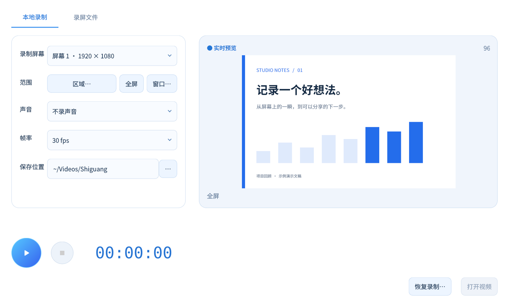
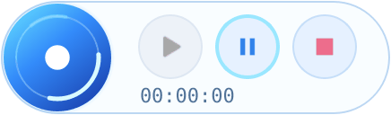
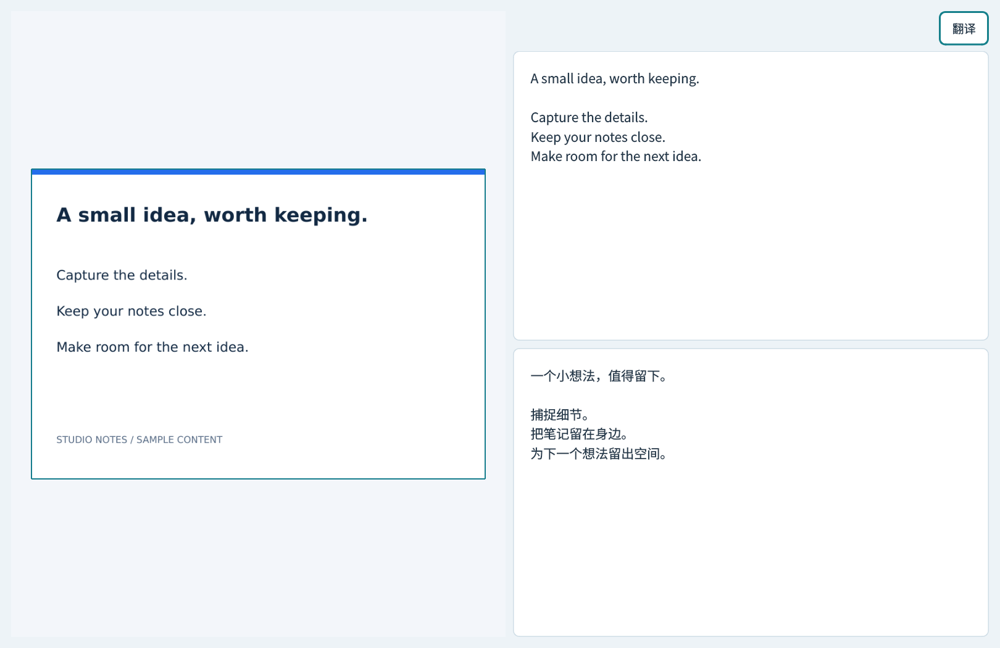

<p align="center"></p>
<h1 align="center">拾光 · Shiguang Capture</h1>
<p align="center"><strong>截下这一刻，接着做下一步。</strong></p>
<p align="center">
  <a href="README.en.md">English</a> ·
  <a href="https://asoming.github.io/shiguang-capture/">产品主页与演示</a> ·
  <a href="https://github.com/asoming/shiguang-capture/releases/latest">最新正式版</a> ·
  <a href="https://github.com/asoming/shiguang-capture/issues">反馈与建议</a>
</p>
<p align="center">
  <a href="https://github.com/asoming/shiguang-capture/releases/latest"></a>
  <a href="https://github.com/asoming/shiguang-capture/actions/workflows/site.yml"></a>
  <a href="#下载与体验"></a>
  <a href="LICENSE"></a>
</p>

拾光是一个免费的开源桌面屏幕捕获工具。**截图就地标注、录屏悬浮控制、离线文字识别与中英翻译**，让屏幕上的内容可以继续编辑和使用。

无需账号。OCR 与翻译模型随安装包提供，图片和文字在本机处理。

## 下载与体验

| 系统 | 下载 v1.4.9 | 开始使用 |
| --- | --- | --- |
| Windows x86_64 | [EXE 安装程序](https://github.com/asoming/shiguang-capture/releases/download/v1.4.9/ShiguangCapture-v1.4.9-Windows-x86_64-Setup.exe) | 双击安装，自动创建快捷方式 |
| macOS Apple Silicon | [TAR.GZ 压缩包](https://github.com/asoming/shiguang-capture/releases/download/v1.4.9/ShiguangCapture-v1.4.9-macOS-arm64.tar.gz) | 解压后将 `.app` 移入应用程序 |
| Linux X11 x86_64 | [DEB 安装包](https://github.com/asoming/shiguang-capture/releases/download/v1.4.9/ShiguangCapture-v1.4.9-Linux-amd64.deb) | 双击安装，或用 `sudo apt install ./ShiguangCapture-v1.4.9-Linux-amd64.deb` |

[全部版本与发行说明](https://github.com/asoming/shiguang-capture/releases/latest) · [SHA256SUMS](https://github.com/asoming/shiguang-capture/releases/download/v1.4.9/SHA256SUMS) · [详细安装说明](guides/REFERENCE.md#安装已发布稳定版)

Windows 包未签名，macOS 使用临时签名、未公证。macOS 系统声音尚未通过验收；多物理屏幕与部分权限恢复场景仍待实机验证。更多见[使用边界](guides/REFERENCE.md#实验与未覆盖范围)与[逐项验收记录](validation/PRD-ACCEPTANCE.md)。



<p align="center"><sub>当前版本的真实应用控件，使用示例演示文稿展示布局。</sub></p>

<details>
<summary><strong>查看蓝色悬浮球动效</strong></summary>
<br>
<p align="center"></p>

点击浮球展开继续、暂停与停止，拖到屏幕侧边可收成蓝色半圆。[网站演示](https://asoming.github.io/shiguang-capture/#demo)支持手动播放和停止。
</details>

## 顺手完成屏幕上的下一步

| 想做什么 | 拾光怎么做 |
| --- | --- |
| 截图并说明重点 | 框选后直接画箭头、矩形、写文字、遮盖或涂画；文字可再次点击编辑，支持撤销重做 |
| 录下完整过程 | 全屏、区域或窗口录制，三秒倒计时，连续实时预览，蓝色浮球暂停、继续、停止 |
| 找到录好的文件 | 录屏文件页查看大小与日期，播放、删除或打开所在文件夹 |
| 从图片提取内容 | 本地中英文 OCR，支持文字、可见代码与简单表格，左图右文校对 |
| 对照外语内容 | 识别后点击翻译，显示原文与译文对照；中英离线模型随包提供 |
| 按自己的习惯操作 | 自定义截图、取色、贴图和录屏快捷键，设置内直接按键录入 |



<p align="center"><sub>真实应用界面，示例文字与译文用于展示布局。OCR 和翻译结果需人工校对。</sub></p>

截图、标注不必打开工作台。截图默认只复制，保存由你决定；OCR 不自动覆盖剪贴板。简单表格支持 Markdown、HTML/TSV 和文本型 XLSX 导出。复杂合并表格尚未支持，滚动长截图为实验功能。

## 开始使用

1. 下载并解压对应系统的安装包。启动进入设置，按需修改快捷键。
2. 按 **F1** 框选截图，就地标注后复制、保存、贴图或提取文字。
3. 按 **F6** 打开录制台；录制中用 **F6** 暂停/继续，**F7** 停止并保存。

关闭窗口后会驻留托盘；完全退出请使用托盘菜单。Linux 安装脚本和 Windows `install-windows.ps1` 可创建桌面快捷方式。

[完整快捷键](guides/REFERENCE.md#功能) · [安装与卸载](guides/REFERENCE.md) · [本版验证记录](validation/RELEASE-1.4.9.md)

## 反馈与参与

欢迎通过 [Issues](https://github.com/asoming/shiguang-capture/issues) 报告问题或提出建议，附上版本、系统、复现步骤和脱敏样图。

[贡献指南](CONTRIBUTING.md) · [安全问题](SECURITY.md) · [更新记录](CHANGELOG.md) · [产品网站维护](guides/WEBSITE.md)

## 开发

Python 3.11 / 3.12。快速准备开发环境：

```bash
python -m venv .venv
# Linux / macOS
source .venv/bin/activate
# Windows PowerShell: .venv\Scripts\Activate.ps1
python -m pip install -e '.[gui,ocr,record,offline,dev]'
python -m shiguang_capture
```

录屏还需配置媒体运行库。Linux 正式包使用锁定依赖与精简 FFmpeg 动态库，完整构建、测试与模型准备见[开发和打包说明](guides/REFERENCE.md#开发验证和打包)。构建成功不等同于所有实机场景验收通过。

## 许可

自有代码采用 [MIT](LICENSE)。模型、FFmpeg 与其他依赖的许可见[第三方声明](THIRD_PARTY_NOTICES.md)及随包许可证。
